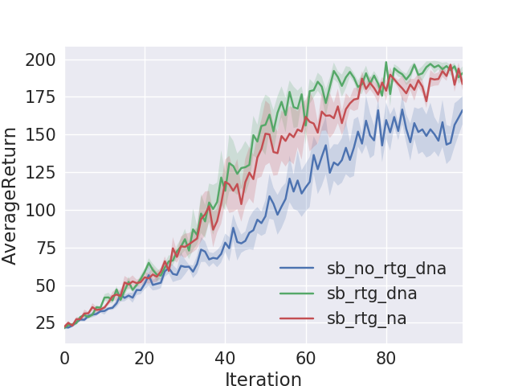
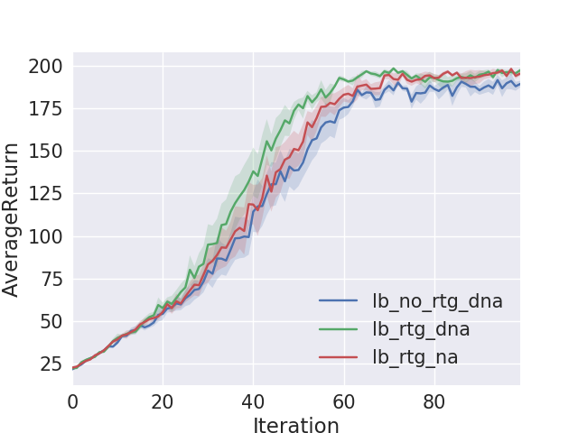
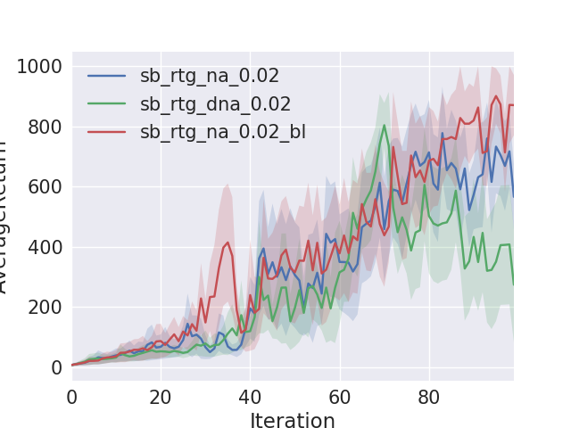

## Testing
```
python train_pg_test.py
```

# Discrete Policy Gradient Training on CartPole-v0

## train_pg.py flags
```
-n : Number of iterations.

-b : Batch size (number of state-action pairs sampled while acting according to the current policy at each iteration).

-e : Number of experiments to run with the same configuration. Each experiment will start with a different randomly initialized policy, and have a different stream of random numbers.

-dna : Flag: if present, sets normalize_advantages to False. Otherwise, by default, normalize_advantages=True.

-rtg : Flag: if present, sets reward_to_go=True. Otherwise, by default, reward_to_go=False.

--exp_name : Name for experiment, which goes into the name for the data directory.
```

## Sample Runs For Discrete CartPole-v0
```
python train_pg.py CartPole-v0 -n 100 -b 1000 -e 5 -dna --exp_name sb_no_rtg_dna

python train_pg.py CartPole-v0 -n 100 -b 1000 -e 5 -rtg -dna --exp_name sb_rtg_dna

python train_pg.py CartPole-v0 -n 100 -b 1000 -e 5 -rtg --exp_name sb_rtg_na

python train_pg.py CartPole-v0 -n 100 -b 5000 -e 5 -dna --exp_name lb_no_rtg_dna

python train_pg.py CartPole-v0 -n 100 -b 5000 -e 5 -rtg -dna --exp_name lb_rtg_dna

python train_pg.py CartPole-v0 -n 100 -b 5000 -e 5 -rtg --exp_name lb_rtg_na
```

## Plot Small Batch (1000) Average Returns
```
python plot.py data/sb_no_rtg_dna_CartPole-v0_26-06-2018_06-25-21 data/sb_rtg_dna_CartPole-v0_26-06-2018_06-40-11 data/sb_rtg_na_CartPole-v0_26-06-2018_07-39-12
```


```
sb: small batch
lg: large batch
rtg: reward to go
no_rtg: no "reward to go"
na: normalize advantages
dna: don't "normalize advantages"
```

## Plot Large Batch (5000) Average Returns
```
python plot.py data/lb_no_rtg_dna_CartPole-v0_26-06-2018_07-51-18 data/lb_rtg_dna_CartPole-v0_26-06-2018_08-44-23 data/lb_rtg_na_CartPole-v0_26-06-2018_10-06-53
```


## Video of CartPole after 100 iterations
[MP4](videos/video_cartpole.mp4)


# InvertedPendulum-v0

## Sample Runs For InvertedPendulum-v0
```
python train_pg.py InvertedPendulum-v1 -n 100 -b 1000 -e 5 -rtg -lr 0.02 --exp_name sb_rtg_na_0.02

python train_pg.py InvertedPendulum-v1 -n 100 -b 1000 -e 5 -rtg -dna -lr 0.02 --exp_name sb_rtg_dna_0.02

python train_pg.py InvertedPendulum-v1 -n 100 -b 1000 -e 5 -rtg -lr 0.02 -bl --exp_name sb_rtg_na_0.02_bl

```
## Plot InvertedPendulum Sample Runs
```
python plot.py data/sb_rtg_na_0.02_InvertedPendulum-v1_27-06-2018_10-45-20 data/sb_rtg_dna_0.02_InvertedPendulum-v1_29-06-2018_09-34-48 data/sb_rtg_na_0.02_bl_InvertedPendulum-v1_29-06-2018_09-47-27 
```


## Video of InvertedPendulum after 100 iterations
[MP4](videos/video_invertedpendulum.mp4)