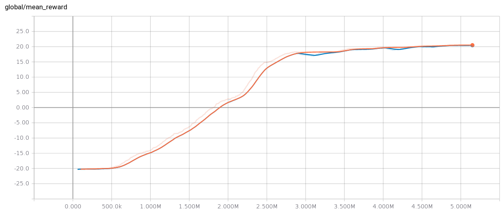

## Run Training
```
python run_dqn_atari.py
```

## Pong Rewards After 5 million steps




## Video of Pong
[MP4](videos/openaigym.video.0.7441.video002000.mp4)

## Homework Instructions

See http://rll.berkeley.edu/deeprlcourse/f17docs/hw3.pdf for instructions

The starter code was based on an implementation of Q-learning for Atari
generously provided by Szymon Sidor from OpenAI

